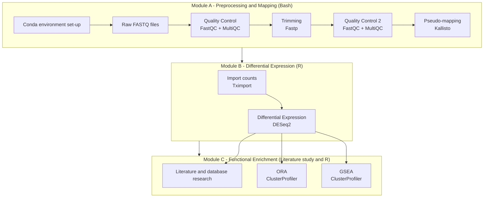

# RNA-Seq-analysis
## Overview
Case study of a full RNA-Seq pipeline, from raw reads to biological interpretation.

## Dataset
This is a bulk RNA-sequencing dataset of in-vitro Th2 cells, subjected to L-phenylalanine treatment to assess its effect on gene expression. Cells were obtained from 5 donors, and incubated for 24h with either Phenylalanine or Vehicle (Ctrl) with simultaneous activation with anti-CD2, anti-CD3 and anti-CD28 antibody beads.  
The experimental design therefore consists of:
- 10 samples (S1-S10).
- From 5 different donors (D1-D5).
- On 2 conditions: L-Phenylalanine treatment and Veh treatment (Ctrl).
- Paired setup (Phe vs Ctrl on the same donor): design = ~ donor + condition.
Original dataset from GEO: GSE291310. 
Platform: Illumina NovaSeq X Plus.

## Pipeline diagram
The RNA-Seq pipeline was performed as follows:

## Conclusions and findings
L-phenylalanine was found to have a moderate influence on key biological processes of Th2 cells, such as differentiation, cell cycle regulation and renal metabolism. To a lesser extent, also cell motility, tissue morphogenesis, and hormone biosynthesis and signalling appear to be affected.

## Tools & Versions
| Tool | Version | Environment |
|------|---------|-------------|
| sra-tools | 3.2.1 | Bash |
| fastqc | 0.12.1 | Bash |
| multiqc | 1.33 | Bash |
| fastp | 1.1.0 | Bash |
| Kallisto | 0.51.1 | Bash |
| rtracklayer | 1.68.0 | R |
| dplyr | 1.2.0 | R |
| tximport | 1.36.1 | R |
| factoextra | 1.0.7 | R |
| Rtsne | 0.17 | R |
| pheatmap | 1.0.13 | R |
| DESeq2 | 1.48.2 | R |
| ggplot2 | 4.0.2 | R |
| org.Hs.eg.db | 3.21.0 | R |
| clusterProfiler | 4.16.0 | R |
| enrichplot | 1.28.4 | R |
| AnnotationDbi | 1.70.0 | R |
| ggridges | 0.5.7 | R |
